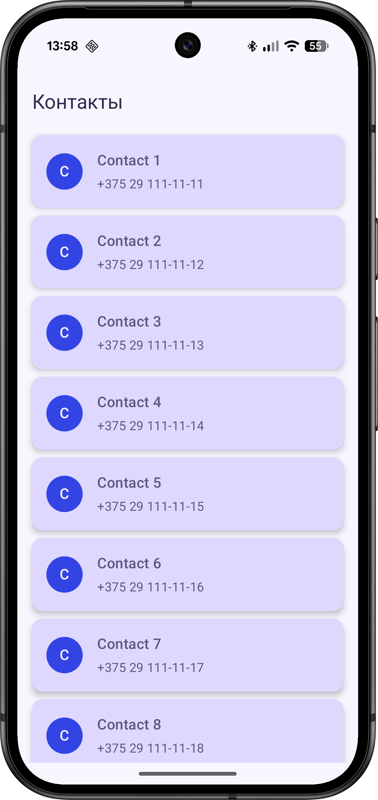
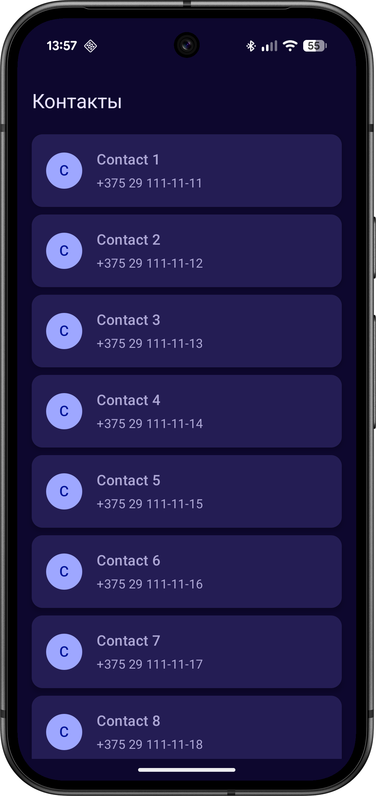
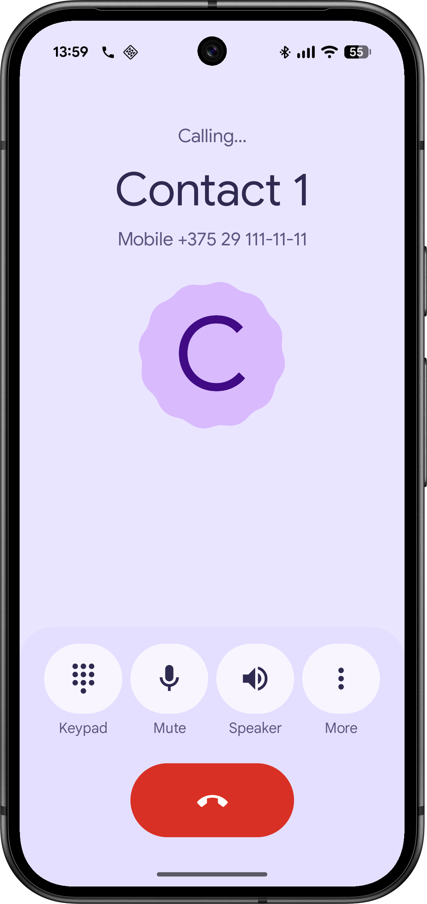
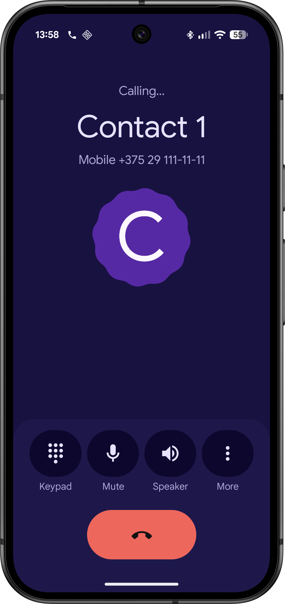

# Contacts App

Android-приложение для просмотра списка контактов, сохраненных на устройстве, с возможностью совершать звонки прямо из приложения. 

  

## Скриншоты

| Список контактов (Светлая тема) | Список контактов (Темная тема) |
| :---: | :---: |
|  |  |

| Экран вызова (Светлая тема) | Экран вызова (Темная тема) |
| :---: | :---: |
|  |  |

## Стек технологий
- **Android Studio** 
- **Kotlin** 
- **Jetpack Compose** 
- **Hilt** 
- **Kotlin Coroutines & Flow**

## Архитектура
Проект построен с соблюдением принципов **Clean Architecture** (Чистой архитектуры) для обеспечения масштабируемости, тестируемости и разделения ответственности. 

Код разделен на три основных слоя:
1. **Domain Layer (Доменный слой)** — содержит бизнес-логику приложения: изолированные сущности (Models), абстракции репозиториев (Interfaces) и UseCase'ы. Этот слой не зависит ни от каких Android-фреймворков.
2. **Data Layer (Слой данных)** — отвечает за получение данных. Включает в себя реализации репозиториев (`ContactsRepositoryImpl`) и локальные источники данных (`ContactsLocalDataSource`), которые напрямую работают с Android API (`ContentResolver`). 
3. **Presentation Layer (Слой представления)** — UI и управление состоянием экранов. 
   - Построен с использованием паттерна **MVI (Model-View-Intent)**.

## Разрешения (Permissions)
Для корректной работы приложения требуются следующие разрешения:
* `android.permission.READ_CONTACTS` — для получения списка контактов.
* `android.permission.CALL_PHONE` — для инициации звонка без перехода в системную звонилку.
